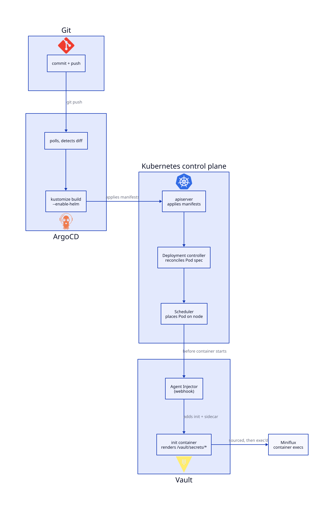

# Miniflux, end to end

- [The first real objects, by hand](first-objects-by-hand.md), [Helm: charting Postgres and Miniflux](helm-charts.md), [Kustomize inflating a Helm chart](kustomize-helm-inflation.md), [Vault: secrets as a live service, not a file in git](vault-secrets.md), and [ArgoCD: git becomes the source of truth](argocd.md) built every piece (raw objects, a Helm chart, a Kustomize overlay, a Vault-backed secret, an ArgoCD Application) against Miniflux specifically, one piece at a time
- This chapter is the capstone: the full chain in one picture, Miniflux's own operational knobs worth knowing, and the failure-mode tests that actually prove the stack, not just that the Pods are `Running`

## The full reconciliation chain



`Render` is `argocd-repo-server` running `kustomize build --enable-helm --load-restrictor LoadRestrictionsNone`: the same command [Kustomize inflating a Helm chart](kustomize-helm-inflation.md) and [Vault: secrets as a live service, not a file in git](vault-secrets.md) already ran by hand, no decryption step, nothing Vault-aware at this stage. `Vault Injector` is the mutating webhook rewriting the Pod at admission ([Policies and roles, scoped per app](vault-secrets.md#policies-and-roles-scoped-per-app)'s role), not a step ArgoCD or kustomize knows anything about.

Five independent reconciliation loops stacked here: ArgoCD (git to cluster objects), the Deployment controller (spec to Pods), the scheduler+kubelet (Pod spec to a running container), the Vault Agent Injector (an admission-time mutation, one-shot per Pod creation), and the Vault Agent sidecar itself (keeps re-rendering for the Pod's whole lifetime, [Try it](vault-secrets.md#try-it)). Each layer only cares about the layer directly below it: a stuck rollout is a [The first real objects, by hand](first-objects-by-hand.md) problem, a stuck sync is an [ArgoCD: git becomes the source of truth](argocd.md) problem, a Pod stuck in `Init` with the wrong env var is a [Vault: secrets as a live service, not a file in git](vault-secrets.md) problem. They don't need to be reasoned about all at once.

## Miniflux's own configuration surface

Beyond the four secret-backed variables already wired up, Miniflux reads a number of plain (non-secret) env vars that shape how it actually behaves as an RSS reader, not just whether it starts. Worth setting deliberately in `charts/miniflux/values-prod.yaml` rather than leaving at their defaults: verify the exact current names against Miniflux's own README before trusting any of these on a version far from what this was written against, the same caveat as [Miniflux](first-objects-by-hand.md#miniflux)'s `/healthcheck` path:

```yaml
env:
  BASE_URL: "https://real-domain.example.com"
  POLLING_FREQUENCY: "60"          # minutes between feed refresh cycles
  BATCH_SIZE: "20"                 # feeds refreshed per polling cycle
  WORKER_POOL_SIZE: "5"            # concurrent feed-fetch workers
  CLEANUP_ARCHIVE_READ_DAYS: "60"  # auto-prune read entries older than this
  METRICS_COLLECTOR: "1"           # exposes /metrics for Prometheus, off by default
```

Add an `env:` loop to `charts/miniflux/templates/deployment.yaml` (alongside the existing `RUN_MIGRATIONS`/`CREATE_ADMIN` pair from [Miniflux](first-objects-by-hand.md#miniflux)) to consume this:

```yaml
env:
  - { name: RUN_MIGRATIONS, value: "1" }
  - { name: CREATE_ADMIN, value: "1" }
{{- range $key, $value := .Values.env }}
  - { name: {{ $key }}, value: {{ $value | quote }} }
{{- end }}
```

`BASE_URL` matters more than it looks: Miniflux uses it to build absolute links inside emails and OPML exports, not just as decoration. Leaving it unset or wrong doesn't break the web UI, it breaks anything Miniflux generates for use *outside* the browser tab you're looking at it in.

## Verify end to end, for real

```sh
curl http://miniflux.local/healthcheck
```

Log into `http://miniflux.local` with the `ADMIN_USERNAME`/`ADMIN_PASSWORD` from [Write the secrets](vault-secrets.md#write-the-secrets)'s Vault write. Add a real feed (any public RSS/Atom URL), then confirm the fetch actually happened, not just that the form submitted:

```sh
kubectl logs -n miniflux deploy/miniflux -c miniflux --tail=50 | grep -i "refresh"
```

## Prove the failure modes, not just the happy path

**Postgres restart, data survives (StatefulSet, [Postgres](first-objects-by-hand.md#postgres)):**
```sh
kubectl delete pod postgres-0 -n platform
kubectl wait --for=condition=Ready pod/postgres-0 -n platform --timeout=60s
curl http://miniflux.local/healthcheck    # recovers once postgres-0 is back
```

**Manual drift, ArgoCD reverts it (selfHeal, [One Application per workload, and sync-wave ordering](argocd.md#one-application-per-workload-and-sync-wave-ordering)):**
```sh
kubectl scale deployment miniflux --replicas=10 -n miniflux
kubectl get deployment miniflux -n miniflux -w    # watch it drop back to values.yaml's replica count within seconds
```

**Secret rotation propagates to the file, not automatically to the process (Vault sidecar, [Try it](vault-secrets.md#try-it)):**
```sh
vault kv put secret/miniflux ADMIN_USERNAME=admin ADMIN_PASSWORD=a-new-password
kubectl exec deploy/miniflux -n miniflux -c miniflux -- cat /vault/secrets/miniflux   # updated within seconds, no restart
kubectl exec deploy/miniflux -n miniflux -c miniflux -- printenv | grep ADMIN_PASSWORD  # still the OLD value
```
The file updates live because the sidecar re-renders it; the running process's environment does not, because env vars are only read once, at process start (`. /vault/secrets/miniflux` only ever runs before `exec miniflux`). Finishing the rotation for real needs a `kubectl rollout restart deployment/miniflux -n miniflux` on top of the `vault kv put` above: the file being current isn't the same as the process having reread it.

## Try it

1. Delete the kind cluster entirely, recreate it from [Local development cluster (kind)](local-cluster-setup.md), redo [GitOps and the repo layout](gitops-repo-layout.md) through [ArgoCD: git becomes the source of truth](argocd.md) in order without looking back at earlier chapters until stuck. This is the real test of whether the chain is understood, not memorized.
2. Explain out loud, without notes, why `secret/platform/postgres` and `secret/miniflux` are two separate Vault paths instead of one, and why Miniflux's policy ([Policies and roles, scoped per app](vault-secrets.md#policies-and-roles-scoped-per-app)) is allowed to read both while Postgres's policy is only allowed to read its own. If you can defend that, [Vault: secrets as a live service, not a file in git](vault-secrets.md)'s material is solid.
3. Break the `command`/`args` override on purpose (typo the path, e.g. `/vault/secrets/typo`), redeploy, and read what actually happens: the container exits immediately with a shell error, not a Vault error, since by the time that line runs Vault's own part is already done. Knowing which of these two failure shapes you're looking at is most of the debugging [Vault: secrets as a live service, not a file in git](vault-secrets.md) ever needs.
